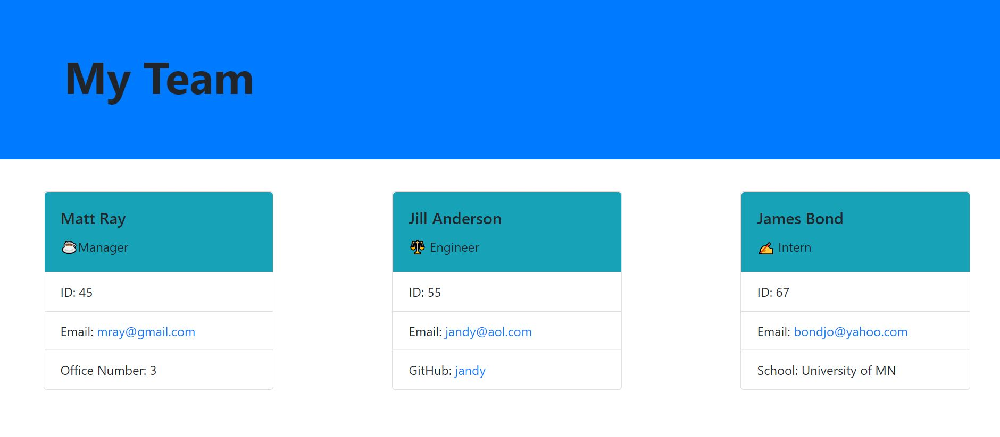
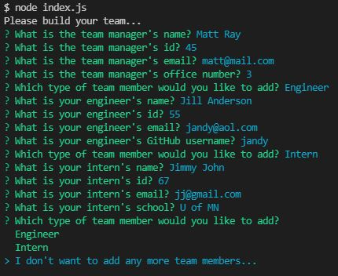

 

 
 # Team Profile Generator

  ## Description

  This is a command line app that will generate a team profile html after answering some prompts.
  
  ## Table of Contents

- [Description](#description)
- [Installation](#installation)
- [Usage](#usage)
- [Contributing](#contributing)
- [Tests](#tests)
- [Questions](#questions)

## Installation

Just run npm install.

## Usage

Run node index.js. Answer the prompts to build the Manager. Once that is complete you can build either a Engineer or an Intern. This will continue until you select no more team members. Once this is selected an html file will be created.

[Link to video of usage](https://drive.google.com/file/d/1lIHUOuKu2HaVBbTGOS_81zreKdQaOEID/view?usp=sharing)

## Contributing

You can build out other roles. Just make an instance of Employee class.

## Tests

Run npm run test

## Questions

If you have any questions you can find me on Github at [m-ray-ofSunshine](https://github.com/m-ray-ofSunshine)

